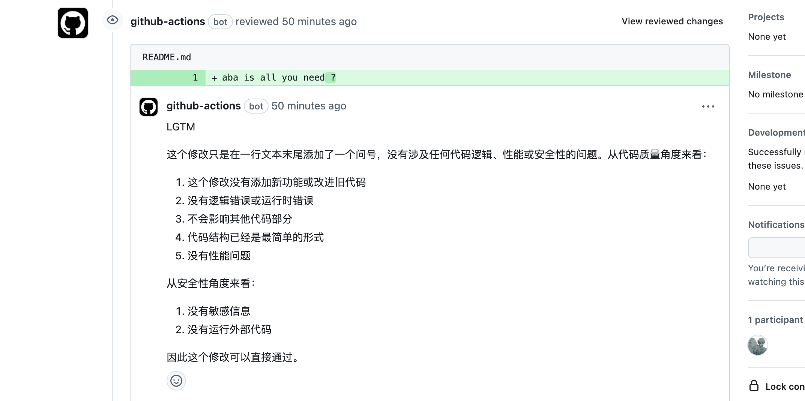
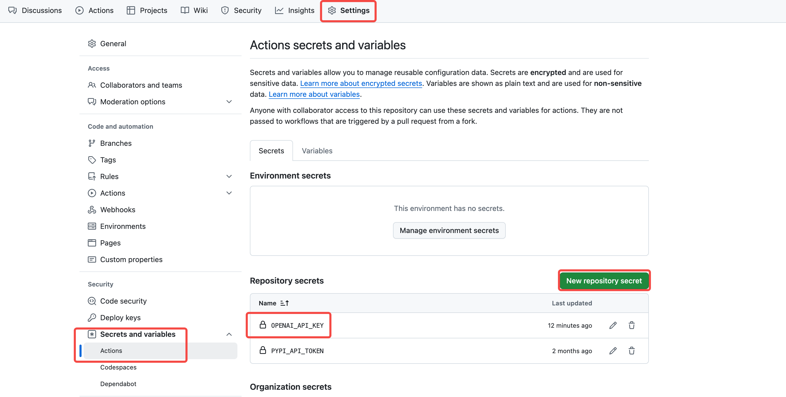

# Lunar

> Yet another AI powered code reviewer

Lunar is short for 'LUnar is Not an Ai Reviewer'. It is a GitHub Action that
uses AI to review your code, designed to be simple and extensible.

## Featuers

- Review Pull Requests with AI and directly comment on each file.
  ([example pr](https://github.com/0xWelt/test-action/pull/2))

  

- Beyond default GPT-4o-mini, Lunar can also use other LLMs like Deepseek, Kimi,
  etc. You only need to specify the `OPENAI_API_KEY` in actions' secrets and
  `OPENAI_BASE_URL` and `MODEL` in the environment variables.

## Develop Plan

- [ ] Fine-tune default prompts for better review quality and simplicity.
- [ ] Add **icons** and **model names** for popular LLMs.
- [ ] Multi-turn conversation support. Context aware code suggestions.

## Quick Start

1. Add the `OPENAI_API_KEY` to your GitHub Actions secrets.

   

2. create `.github/workflows/lunar.yml`

   ```yaml
   name: Lunar Code Review

   permissions:
     contents: read
     pull-requests: write

   on:
     pull_request_target:
       types: [opened, reopened, synchronize]

   jobs:
     test:
       runs-on: ubuntu-latest
       steps:
         - uses: 0xWelt/Lunar@main
           env:
             GITHUB_TOKEN: ${{ secrets.GITHUB_TOKEN }}
             # # Optional, change as you wish or comment out to use default
             # LLM settings
             OPENAI_BASE_URL: https://api.deepseek.com/v1 # https://api.openai.com/v1
             OPENAI_API_KEY: ${{ secrets.OPENAI_API_KEY }}
             MODEL: deepseek-chat # gpt-4o-mini
             TEMPERATURE: 1.0 # 1.0
             MAX_TOKENS: 8192 # 4096
             # Lunar settings
             LANGUAGE: Chinese # Chinese
             IGNORE_PATTERNS: # glob pattern or regex pattern to ignore files, separated by comma
   ```

## Star History

[](https://star-history.com/#0xWelt/Lunar&Date)

## Contributors

<a href="https://github.com/0xWelt/Lunar/graphs/contributors">
  
</a>

## Acknowledgements

- This project is based heavily on
  [anc95/ChatGPT-CodeReview](https://github.com/anc95/ChatGPT-CodeReview/tree/main)
